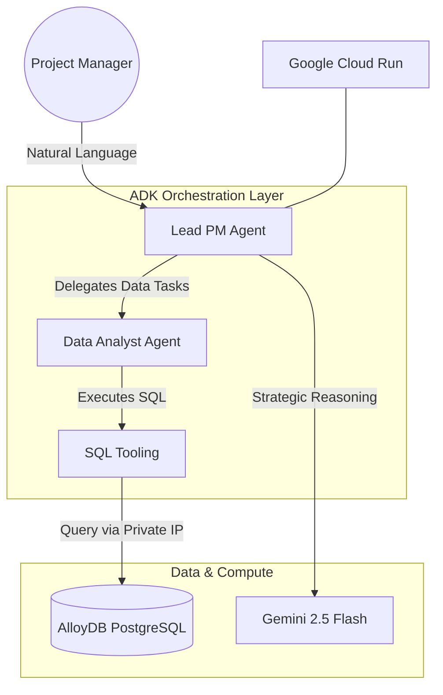

# 🚀 AI Project Command Center
### *Gen AI Academy APAC Edition – Cohort Project*

The **AI Project Command Center** is a multi-agent orchestration platform designed to automate project risk assessment and decision support for project managers. It combines the reasoning power of **Gemini 2.5 Flash**, the orchestration capabilities of **Google ADK**, and structured data intelligence from **AlloyDB** to deliver real-time, actionable insights.

---

## 📌 Problem Statement

Project managers often spend a large portion of their time switching between tools like GitHub, Jira, databases, and email just to understand project status. This creates delays, hides risks, and makes it harder to take timely action.

---

## 💡 Solution

**AI Project Command Center** solves this by bringing project intelligence into one conversation.

- It understands natural language requests from project managers.
- It delegates data tasks to a specialist agent.
- It queries live project data from AlloyDB using SQL.
- It can trigger real-world actions through MCP, such as scheduling a calendar review.
- It returns a clear executive summary with risk insights and mitigation steps.

---

## 🏗️ System Architecture

The solution uses a delegated multi-agent pattern to ensure accuracy, modularity, and secure access to project data.

---

## 🌟 Key Features

- **Multi-Agent Collaboration:** A root PM agent coordinates with a Data Analyst agent to handle user requests intelligently.
- **Direct Database Grounding:** The assistant queries live project records from AlloyDB instead of relying on static documents.
- **Action Automation:** If a project is high risk, the system can automatically trigger a calendar event using MCP.
- **Production Deployment:** The app is deployed on Google Cloud Run and exposed through a live public URL.
- **Hackathon Coverage:** The solution demonstrates ADK orchestration, MCP tool use, and AlloyDB AI in one project.

---

## 🛠️ Tech Stack

| Component | Technology |
|---|---|
| LLM | Gemini 2.5 Flash |
| Orchestration | Google ADK (Agent Development Kit) |
| Database | AlloyDB for PostgreSQL |
| Tool Integration | Model Context Protocol (MCP) |
| Infrastructure | Google Cloud Run |

---

## 🔄 How It Works

1. The project manager asks a question in natural language.
2. The root agent analyzes the request and decides whether data lookup or action is needed.
3. The Data Analyst agent generates SQL and queries AlloyDB.
4. The Executor agent can trigger a calendar action if high risk is detected.
5. The root agent synthesizes the results into a concise, actionable response.

---

## 🚀 Live Demo

Access the production prototype here:  
[Project Command Center UI](https://pm-command-center-93150528623.us-central1.run.app/dev-ui/)

---

## 📂 Project Structure

- `pm_assistant/` — Core agent logic and tool definitions.
- `agent.py` — Orchestration logic for the Manager and Analyst agents.
- `sql_tool.py` — Secure SQL execution bridge to AlloyDB.
- `requirements.txt` — Project dependencies.

---

## ✅ How to Run / Verify

1. Open the [Dev UI](https://pm-command-center-93150528623.us-central1.run.app/dev-ui/).
2. Ask this query: **“List all high-risk projects and give me a PM mitigation strategy.”**
3. Confirm that the result matches the project records in [AlloyDB Studio](https://console.cloud.google.com/alloydb/locations/us-central1/clusters/pm-command-center-cluster/studio?cloudshell=true&project=multi-agentassistant).

If the assistant returns the expected projects and mitigation guidance, your database connection and orchestration flow are working correctly.

---

## 🧪 Example Query

**User:** Which projects are at risk of going over budget? Schedule a review if high risk is detected.

**System behavior:**
- The root agent interprets the request.
- The Data Analyst agent queries AlloyDB.
- The Executor agent creates a follow-up calendar event if needed.
- The assistant returns a summarized risk report.

---

## 📈 Impact

This solution helps project managers:
- Save time by reducing context switching.
- Detect project risks earlier.
- Take action faster with automated follow-ups.
- Use one conversation to access data, insights, and workflow automation.

---

## 📍 Submission Summary

This project is built for the **Gen AI Academy APAC Edition** and demonstrates:

- **Track 1:** Google ADK multi-agent orchestration.
- **Track 2:** MCP-based tool integration.
- **Track 3:** AlloyDB AI with a custom project-risk dataset.

---

## 🙌 Closing

Thank you for reviewing **AI Project Command Center**. This prototype demonstrates how multi-agent AI can unify project intelligence, automate decision support, and trigger real-world actions from a single conversation.
